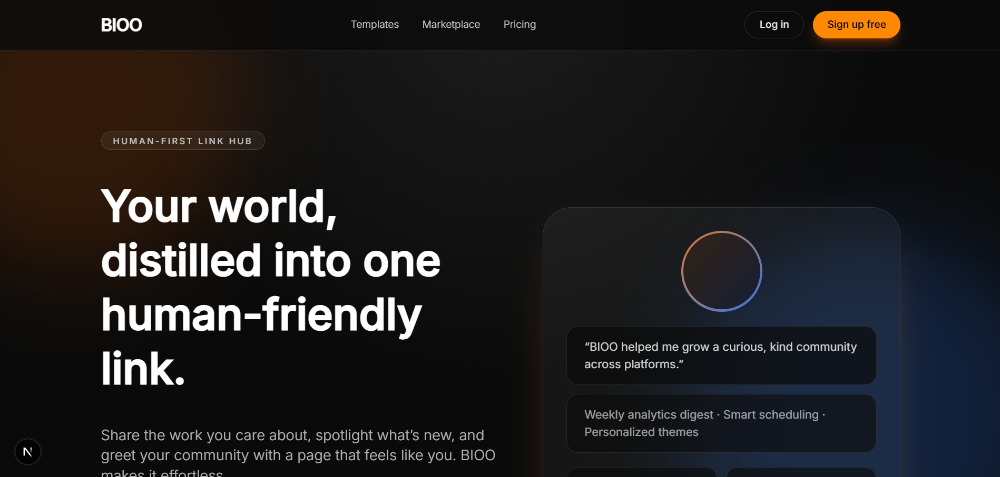
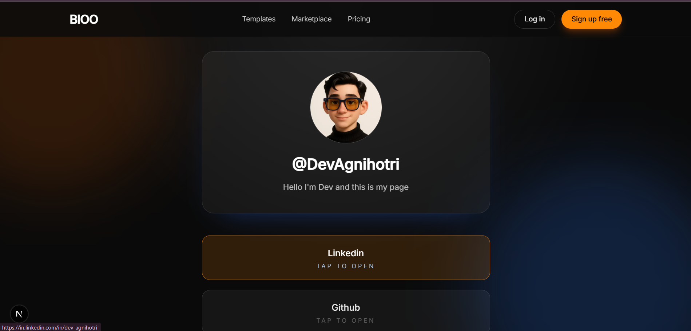
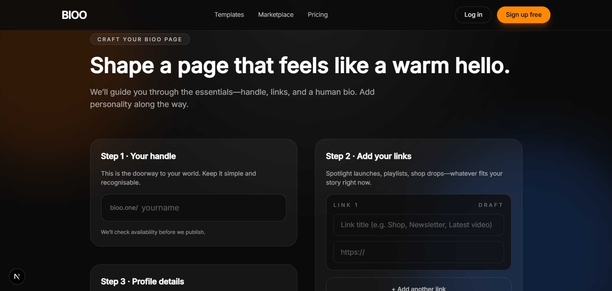
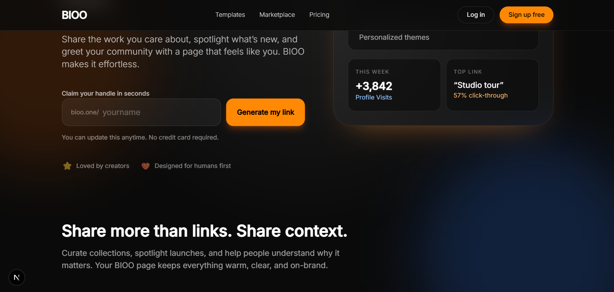

<div align="center">

# 🌐 BIOO

### _Your Personal Link Hub, Done Right_

[](https://nextjs.org/)
[](https://www.mongodb.com/)
[](https://tailwindcss.com/)

**One handle. All your links. Zero complexity.**

</div>

---

## 👋 What I Built

I created BIOO because I was tired of scattered social links and clunky link-in-bio tools. I wanted something clean, fast, and developer-friendly that I could actually own.

**BIOO** lets you claim a unique handle, add your important links, and share one simple URL that represents your entire online presence. Think of it as your personal landing page on steroids.

I built this using **Next.js 14** with the App Router, hooked it up to **MongoDB** for persistence, and made sure everything feels snappy with real-time validation and instant feedback.

## 🚀 Core Features

| Feature | Description |
|---------|-------------|
| **Handle System** | Claim your unique `@handle` and get your own shareable URL |
| **Lightning Fast** | Built on Next.js 14 with optimized server components for instant loads |
| **Link Management** | Add, edit, and organize unlimited links in one place |
| **Mobile Ready** | Fully responsive design that looks great on any device |
| **Data Persistence** | All your links safely stored in MongoDB Atlas |

## 🛠️ Tech Stack I Used


```
Frontend
├── Next.js 14 (App Router)    → Server & client components
├── React 18                    → UI layer
└── Tailwind CSS                → Styling without the mess

Backend
├── Next.js API Routes          → Serverless endpoints
└── Server Actions              → Form handling done right

Database
└── MongoDB Atlas               → Document store with connection pooling

Developer Tools
├── ESLint                      → Code quality checks
├── React Toastify              → User feedback
└── Thunder Client              → API testing during development
```

## 🔌 API Endpoints I Built

I designed three clean API routes that power the entire app:

| Endpoint        | Method | What It Does                                             |
| --------------- | ------ | -------------------------------------------------------- |
| `/api/check`    | POST   | Checks if a handle is available before you claim it      |
| `/api/generate` | POST   | Saves all your links to the database when you hit submit |
| `/api/add`      | POST   | Adds a single new link to your existing collection       |

All routes accept JSON and return JSON. Simple, predictable, easy to debug.

## 📂 How I Structured Everything

I kept the folder structure clean and logical so I can find things fast:

```
app/
 ├── api/
 │   ├── add/route.js        → Adds new links
 │   ├── check/route.js      → Validates handles
 │   └── generate/route.js   → Saves link collections
 ├── generate/
 │   ├── page.js             → Server component wrapper
 │   └── GenerateClient.jsx  → Client form with hooks
 ├── [handle]/
 │   └── page.js             → Public landing page for each user
 ├── layout.js               → Root layout with navbar
 └── page.js                 → Homepage where you claim handles

component/
 └── Navbar.js               → Shared nav component

lib/
 └── mongodb.js              → MongoDB connection with pooling
```

**Why I did it this way:**

- Kept client components separate from server components to avoid build errors
- Used dynamic routes `[handle]` for user pages
- Centralized DB logic so I don't repeat connection code everywhere

## � Screenshots

### Landing Page



_This is where you claim your unique handle_

---

### Real-Time Handle Check



_I built instant validation so you know right away if your handle is free_

---

### Creating Your Space



_Clean, simple flow to get you set up fast_

---

### Register Handle



_Register your handle you want to share_

## 💡 Technical Decisions I Made

### Why Next.js App Router?

I wanted to use the latest React patterns with server components. It lets me fetch data on the server, reducing client-side JavaScript and making pages load faster.

### Why MongoDB?

I needed flexible document storage for links. Each user's data structure can vary (different number of links, different fields), and MongoDB handles that perfectly without rigid schemas.

### Connection Pooling

I set up a reusable MongoDB client in `lib/mongodb.js`. This prevents opening a new connection on every API call, which would kill performance in production.

### Client vs Server Components

I separated `GenerateClient.jsx` from `page.js` because I hit a Next.js build error. The `useSearchParams` hook needs to run client-side, so I moved all client logic to its own component.

### Toast Notifications

I added React Toastify for user feedback. Every action (success or error) gives instant visual confirmation so users aren't left guessing.